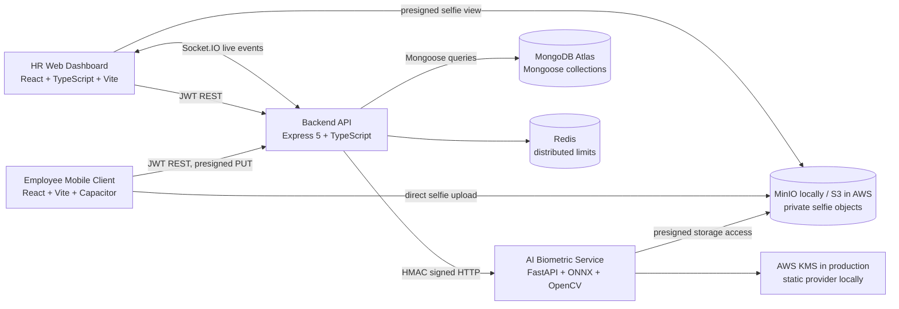
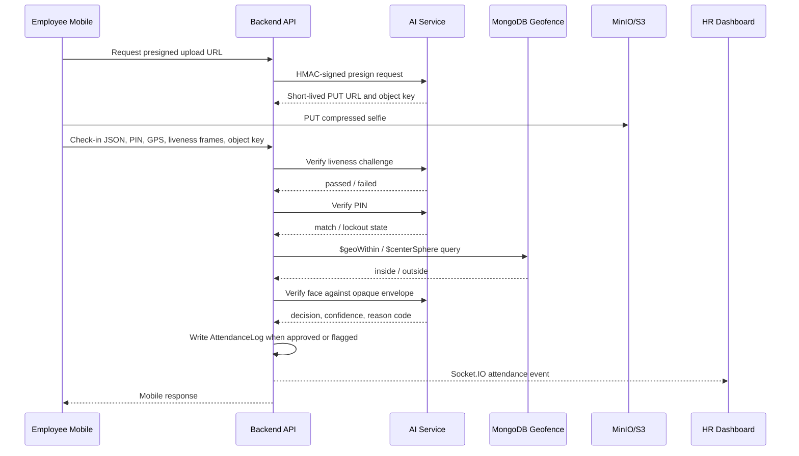

# PNSM Workforce Attendance and Management System

## Project Report

**Course:** CSE482L - Internet and Web Technology  
**Institution:** North South University  
**Group:** 8  
**Project name:** PNSM (Productivity, Network, and Staff Management)  
**Report status:** Based on the locally dev-complete implementation available in this repository  
**Date:** 8 September 2026

> **Evidence note.** This report distinguishes implemented and locally verified functionality from planned cloud deployment and native-device work. The repository contains no public production URL and no captured UI screenshots. Local addresses such as `http://localhost:3000` and `http://localhost:5173` are development endpoints, not live deployment URLs. Figure 1 and Figure 2 are architecture diagrams generated from the implementation; screenshots should be inserted only after they are captured from the running system.

## Table of Contents

1. [Abstract / Executive Summary](#abstract--executive-summary)  
2. [Introduction](#1-introduction)  
3. [Problem Statement](#2-problem-statement)  
4. [Objectives](#3-objectives)  
5. [Proposed Solution](#4-proposed-solution)  
6. [Target Users](#5-target-users)  
7. [Scope of the Project](#6-scope-of-the-project)  
8. [System Architecture](#7-system-architecture)  
9. [Technology Stack](#8-technology-stack)  
10. [User Interface Design](#9-user-interface-design)  
11. [Features and Functionalities](#10-features-and-functionalities)  
12. [Database Design and Schema](#11-database-design-and-schema)  
13. [Implementation](#12-implementation)  
14. [Performance and Security](#13-performance-and-security)  
15. [Testing](#14-testing)  
16. [Deployment](#15-deployment)  
17. [Cost and Quotation](#16-cost-and-quotation)  
18. [Limitations](#17-limitations)  
19. [Future Work](#18-future-work)  
20. [Conclusion](#19-conclusion)  
21. [References](#references)

## Abstract / Executive Summary

Workforce attendance systems commonly depend on passwords, manual registers, or a single location signal. These approaches make it difficult to establish that the correct employee is physically present at an authorised workplace. PNSM addresses this problem through an AI-verified, location-aware attendance platform intended for employees, human-resources personnel, administrators, and super administrators. Employees use a Capacitor-based mobile client to authenticate, obtain a current GPS position, pass geofence and device-integrity checks, complete an active-illumination liveness challenge, capture a selfie, and submit a four-digit PIN. The web command centre enables HR staff to enrol employees, configure offices and geofences, monitor live attendance, review flagged events, manage leave, inspect audit information, and export reports.

The system is implemented as four cooperating quadrants. The mobile and web clients use React and Vite; the backend uses Express 5, TypeScript, MongoDB through Mongoose, JWT authentication, Redis-backed rate limiting, and Socket.IO; the biometric service uses Python, FastAPI, OpenCV YuNet, ONNX ArcFace inference, calibrated confidence scoring, and AES-256-GCM encryption with an AWS KMS deployment path. Selfie transfer uses short-lived presigned S3-compatible URLs, while HMAC authenticates backend-to-AI requests. The repository records a complete local Docker integration, Atlas connectivity, and 742 passing tests across the four quadrants. The expected impact is a more trustworthy attendance record that combines identity, presence, liveness, and administrative review while keeping biometric material isolated from ordinary employee profile data.

## 1. Introduction

PNSM is a workforce attendance and management system designed for organisations that need more evidence than a conventional clock-in form can provide. The project was developed as a CSE482L group project at North South University and is organised as a single repository containing four independently owned but contractually integrated components. Its central domain is attendance integrity: the system must determine whether an authenticated employee is attempting to check in from an assigned workplace using a live face, an acceptable device, and a valid personal PIN.

The platform combines operational management with biometric and geospatial verification. The employee-facing application is a browser-capable React application that can also be packaged as a native Android or iOS application through Capacitor. The HR-facing command centre is a responsive React and TypeScript dashboard. An Express API coordinates authentication, authorisation, persistence, geofencing, attendance records, leave, uploads, and real-time events. A separate FastAPI service owns face inference, PIN security, liveness analysis, encryption, and object-storage presigning. This separation allows the computationally and security-sensitive biometric workload to remain isolated from the main API.

The implementation is locally dev-complete rather than publicly deployed. The root Docker Compose stack provisions the supporting services and application containers, while the two frontends run through their native Vite development servers. The repository also contains AWS ECS, S3, CloudFront, KMS, IAM, and deployment templates for a later production deployment.

## 2. Problem Statement

A conventional attendance application may record a user identifier and a timestamp, but this does not establish that the employee was physically present at the assigned office. Password sharing, proxy attendance, GPS spoofing, replayed photographs, weak PINs, and manually entered locations can all undermine the reliability of the record. A location-only system is also vulnerable because a spoofed coordinate can appear valid without proving the employee's identity. A face-only system has a different weakness: a photograph or screen replay can be presented from outside the workplace, and raw biometric data creates a permanent privacy risk if it is stored with ordinary personnel information.

Existing approaches also tend to separate operational monitoring from verification. HR staff may receive a static report after the fact rather than a live stream of new check-ins. Borderline face matches may be rejected automatically even when a human reviewer should investigate them. Finally, clients and services often implement slightly different payload shapes, coordinate orders, token conventions, and error formats. Such inconsistencies produce failures that are difficult to diagnose and can weaken security controls silently.

PNSM addresses this gap by combining several independent controls in a defined order. The backend obtains identity from a JWT, the AI service verifies the PIN and face, MongoDB performs the authoritative geofence query, the mobile client supplies device and liveness evidence, and Socket.IO publishes the resulting attendance event to HR. Biometric vectors are encrypted inside the AI service and stored as an opaque envelope in a separate collection, reducing the chance that a normal employee query exposes sensitive biometric material.

## 3. Objectives

The primary objective is to develop a full-stack attendance platform using modern web technologies and a service-oriented architecture. The project aims to provide a React-based employee client and a React/TypeScript administrative dashboard, an Express and TypeScript backend, persistent MongoDB storage, authenticated APIs, and a separate AI service for biometric operations. It also aims to demonstrate practical integration of authentication, authorisation, geospatial queries, object storage, real-time communication, and security controls within one coherent application.

A second objective is to make the attendance decision evidence-based. The system should reject malformed or stale captures, detect mock locations and emulators where possible, verify an employee PIN, confirm that the device lies within an assigned geofence, perform face comparison against an enrolled reference, and record the decision for HR review. The project further aims to reduce biometric exposure through service isolation and encryption, prevent replay and online guessing, and provide actionable error codes to both clients.

A third objective is engineering quality. Each quadrant should be independently testable, API contracts should remain explicit, deployment manifests should be checked as code, and cross-quadrant integration should be verified with the real local stack. The final implementation also seeks to provide a credible migration path from local development to MongoDB Atlas, AWS ECS, S3, CloudFront, and KMS without claiming that those production resources already exist.

## 4. Proposed Solution

PNSM proposes a layered client-server solution. An employee first signs in with an employee code and password. The mobile application then retrieves the employee profile, assigned office, geofence, shift, and recent history from the backend. During check-in, the app requests camera and location permissions, obtains a fresh high-accuracy location, performs a local geofence pre-check for immediate feedback, checks mock-location status, captures an active-illumination liveness sequence, captures the identity selfie, compresses it to a maximum of 200 KB, uploads it directly to object storage using a presigned URL, and submits only the object key and metadata to the backend.

The backend performs the authoritative workflow. It validates the access token and request schema, calls the AI service for liveness and PIN verification, validates the location using MongoDB's `$geoWithin` and `$centerSphere`, retrieves the employee's opaque face-embedding envelope, and calls the AI service for face verification. An approved or HR-flagged result creates an `AttendanceLog`; a rejected face comparison does not create an attendance record. The backend then emits an event through Socket.IO so the web command centre can update its live feed.

The AI service applies image decoding, YuNet face detection, landmark alignment, CLAHE enhancement, quality gates, ArcFace ONNX inference, vector normalisation, and calibrated logistic confidence scoring. Its active-illumination liveness endpoint compares captured frames with the reported screen-flash colours. The service holds the plaintext embedding only within its own process and returns an AES-256-GCM envelope for persistence. In local development, MinIO substitutes for S3 and a static key provider substitutes for AWS KMS; the production templates use KMS envelope keys and private S3 storage.

The system's distinguishing aspect is the explicit ownership boundary. Person 3's API never handles raw selfie bytes during normal transfer and never decrypts the face vector. Person 4's service does not own JWT, MongoDB queries, or dashboard logic. This reduces coupling and makes the security assumptions visible at the interfaces.

## 5. Target Users

Employees are the primary operational users of the mobile client. They need a fast and understandable check-in flow, clear permission and location feedback, a secure login, an assigned workplace, a shift display, a PIN pad, and an explanation when a check-in is blocked or requires review. They do not manage their own office or geofence assignment; those values are supplied by HR through the backend.

HR officers and administrators use the web command centre. They create and update employee records, upload reference photographs, issue initial credentials, assign offices and shifts, configure geofences, inspect attendance logs, review flagged matches, approve or reject exceptions, manage leave requests, inspect the live map, and export CSV or PDF reports. The interface is protected by backend permissions, not only by client-side navigation guards.

Super administrators have the additional responsibility of managing administrators, policies, audit records, spoof alerts, billing information, and incident data. They also require operational visibility into the health of the platform and the integrity of its security configuration. Developers and operators are secondary users of the health, readiness, metrics, Docker, deployment, seed, audit, and rollback tools.

## 6. Scope of the Project

The implemented scope includes employee and administrator authentication, JWT access and refresh tokens, role-based access control, employee CRUD and soft deactivation, reference-photo enrolment, office and geofence management, mobile profile retrieval, PIN verification, liveness challenge handling, GPS validation, face comparison, attendance logging, anomaly reporting, heartbeat telemetry, leave approval and rejection, dashboard KPIs and trends, live Socket.IO events, live-map data, audit and spoof-alert views, billing and policy views, and CSV/PDF export.

The scope also includes a local seven-service Docker topology consisting of MongoDB, MinIO, a one-shot MinIO initialiser, Redis, the AI service, the backend, and an optional TLS/PQC reverse proxy. The web and mobile clients are intentionally run from their own Vite servers in the local-development phase. Security features include HMAC service authentication, encrypted fields, presigned transfers, rate limiting, incident blocking, security headers, replay protection, input validation, and supply-chain audit gates.

The semester scope excludes a public production deployment, real AWS account provisioning, a certified ISO/IEC 30107-3 presentation-attack detector, a fully compiled native Android or iOS project, reliable iOS commercial spoof-location detection, and a complete native background-telemetry credential design. The repository contains scaffolds and deployment templates for these areas, but they must not be described as completed production capabilities. No payment gateway is implemented; the billing interface is an administrative data view rather than a payment-processing workflow.

## 7. System Architecture

PNSM follows a client-server and service-oriented architecture. The web and mobile clients are presentation and interaction layers. Person 3 is the central application API and persistence coordinator. Person 4 is a specialised internal service. MongoDB stores operational data, MinIO or S3 stores images, Redis stores distributed rate-limit and incident-blocklist state, and Socket.IO carries real-time administrative events. Figure 1 summarises these components and their communication boundaries.

**Figure 1. High-level PNSM architecture**

The principal data flow is ordered to reject inexpensive failures before expensive inference. The sequence in Figure 2 shows how the backend authenticates the request, the AI service verifies liveness and PIN, MongoDB validates the point against the assigned geofence, the AI service decrypts and compares the reference embedding, the backend writes an attendance record where appropriate, and Socket.IO broadcasts the event. The refresh token is issued in an HttpOnly cookie and also in the response body because Capacitor WebViews cannot reliably depend on the cookie path; access tokens remain in memory.

**Figure 2. Check-in sequence**

## 8. Technology Stack

The mobile client uses React 18, Vite, Tailwind CSS v4, React Router 7, Axios, Vitest, and Capacitor 8 plugins for camera, geolocation, device information, preferences, local notifications, background runner support, and native packaging. Its JavaScript modules isolate hardware bridges, image compression, geofence calculations, mock-location inspection, liveness capture, HTTP token handling, and check-in orchestration.

The dashboard uses React 18 with Vite 6, TypeScript in strict mode, React Router 7, Tailwind CSS v4, TanStack Query 5, TanStack Table 8, React Hook Form, Zod, MapLibre GL JS, Recharts, Socket.IO Client, Papa Parse, and jsPDF. These choices support typed API boundaries, caching, server pagination, WebGL geofences and live maps, charts, and report export. React lazy loading keeps page-specific code out of the initial bundle.

The backend uses Node.js with Express 5 and TypeScript. Mongoose provides the MongoDB data layer, Zod validates bodies and query parameters, JSON Web Tokens provide access and refresh authentication, bcryptjs hashes administrative passwords, Helmet and CORS harden HTTP responses, Socket.IO provides live events, ioredis and rate-limiter-flexible provide distributed rate limiting, and cookie-parser handles refresh cookies. The backend supports HS256 for local development and an RS256 configuration path for production.

The AI service uses Python 3.11 or later, FastAPI, Pydantic settings, OpenCV YuNet for face detection, ONNX Runtime with an ArcFace `w600k_mbf` model for 512-dimensional embeddings, NumPy, cryptography, and bcrypt. The service uses a calibrated logistic mapping rather than treating raw cosine similarity as a percentage. It also exposes storage presigning and liveness routes. MinIO provides local S3-compatible storage, while the deployment templates target S3, ECS Fargate, CloudFront, IAM, and KMS.

No Firebase, Appwrite, Clerk, Supabase, Stripe, PayPal, or other hosted authentication or payment provider is part of the implemented system. Authentication is owned by the backend through JWT and RBAC. Billing is represented by a dashboard route and data model, not an external transaction gateway.

## 9. User Interface Design

The mobile interface is designed around a short operational workflow. The login page requests an employee code and password. The home page presents the employee identity, current date, assigned office, current attendance state, recent check-ins, and a check-in action. The check-in page displays GPS distance and geofence status, a four-digit PIN pad, liveness and capture progress, and a result state distinguishing success, review, rejection, blocking, cancellation, and system error. The profile page shows the assigned office, shift, location-tracking status, and sign-out action. Battery-optimisation guidance is displayed where relevant.

The web interface is a command centre for repeated HR work rather than a marketing page. It contains authenticated routes for the dashboard, employee roster, employee creation and details, geofence studio, attendance logs, flagged queue, leave, live map, reports, settings, and super-administrator pages. The dashboard presents KPIs, attendance trends, and a live feed. Geofence Studio uses MapLibre and a radius editor, while the attendance and report pages use server-side pagination and client-side export assembly. Role and permission guards keep navigation coherent, while the API remains the actual security boundary.

The redesign uses a dark-default token system and a Bento-style grid engine across both frontends. The web dashboard includes Safari 16.3 flexbox fallbacks, constrained tiles, responsive breakpoints, and lazy-loaded pages. The mobile layout uses compact tiles and preserves the camera target and result overlays during the visual migration. Both interfaces include explicit loading, empty, error, and action-confirmation states. The repository does not contain screenshot artifacts; Figure 3 should be added after capturing the login, dashboard, geofence, flagged queue, and mobile check-in screens from the verified local stack.

**Figure 3. Required UI evidence for the final submission (screenshots not present in repository).**

| Screenshot | Required caption | Status in repository |
|---|---|---|
| Web dashboard | Figure 3(a). HR dashboard showing KPIs, trend, and live attendance feed. | Not captured |
| Web geofence studio | Figure 3(b). MapLibre geofence editor with office radius. | Not captured |
| Web flagged queue | Figure 3(c). HR review queue with approve/reject action. | Not captured |
| Mobile check-in | Figure 3(d). Employee check-in screen showing GPS, PIN, and liveness states. | Not captured |
| Authentication | Figure 3(e). Mobile or web authentication flow. | Not captured |

## 10. Features and Functionalities

Authentication supports separate administrative and mobile route families. Administrators sign in with email and password; employees sign in with employee code and password. Access tokens have a fifteen-minute lifetime and are held in memory. Refresh tokens have a seven-day lifetime, are rotated, and are returned both in an HttpOnly cookie and in the response body to support browser and Capacitor contexts. The backend verifies the JWT on every protected route and applies a role-permission matrix. The first Super Admin is created through an idempotent seed script because the system intentionally has no public signup endpoint.

Employee management provides creation, listing, search, pagination, update, photo update, and soft deactivation. Employee creation generates an initial password and a PIN, asks the AI service to hash the PIN, and attempts to generate an encrypted reference embedding from the uploaded photo. The response distinguishes a successful embedding or PIN operation from a profile that needs attention. Reference images are compressed before upload and transferred directly to object storage through presigned URLs.

Attendance processing combines the controls described in the architecture section. The mobile client performs permission, GPS, geofence, anti-spoof, capture, liveness, compression, upload, and submission stages. The backend performs the corresponding authoritative checks. A face confidence of at least 85 is approved. Under the configured three-band policy, a confidence from 60 to below 85 is flagged for HR review, while a lower confidence is rejected without an attendance log. The AI service publishes the calibrated threshold values and reason codes rather than exposing raw cosine values to employees.

HR can view paginated attendance logs, feeds, live-map data, short-lived selfie URLs, and flagged items. Approve and reject actions update reviewable attendance records. Socket.IO events include `attendance:new`, `attendance:flagged`, `spoof:alert`, and `notification:new`. The dashboard consumes these events through a singleton connection whose JWT is placed in the handshake `auth` payload rather than in a query string.

The system supports offices and multiple geofences, leave requests and decisions, dashboard KPIs, Dhaka-time trends, audit records, spoof alerts, policies, billing views, and report export. CSV export uses Papa Parse, and PDF export uses lazy-loaded jsPDF and jsPDF-AutoTable. There is no payment capture, refund, subscription, or gateway callback implementation; the billing screen is therefore informational or administrative rather than a payment solution.

The AI service provides enrolment, verification, PIN hashing and verification, presigned PUT and GET URLs, active-illumination liveness, readiness, metrics, and administrative calibration/warmup operations. Passive presentation-attack analysis based on moire energy and edge sharpness is recorded as an uncertified signal and is not used alone to reject a check-in.

## 11. Database Design and Schema

MongoDB is the operational database. Mongoose schemas define validation, indexes, references, timestamps, and field visibility. The principal entities are `User`, `Role`, `Office`, `Geofence`, `Shift`, `AttendanceLog`, `LeaveRequest`, `Notification`, `AuditLog`, `SpoofAlert`, `Policy`, `Billing`, `Heartbeat`, `FaceEmbedding`, and `IncidentBlocklist`. The exact deployment may also retain a local Mongo container as an offline fallback, although the documented current compose configuration points the backend to MongoDB Atlas through `MONGODB_URI`.

A `Role` is referenced by each `User` and determines permissions. An employee user may reference one office and one shift. An office may own multiple geofences. An `AttendanceLog` references the employee and geofence, stores device-reported and server-received timestamps, status, confidence, selfie object key, liveness and mock-location outcomes, and an encrypted GPS envelope. `LeaveRequest` references a user and contains dates and approval status. `SpoofAlert` and `AuditLog` provide administrative evidence. `Heartbeat` is bounded by capped or TTL behaviour so periodic telemetry does not grow without limit.

Face embeddings are deliberately not stored on `User`. `FaceEmbedding` contains a unique employee reference, model version, timestamps, and an opaque envelope returned by the AI service. The envelope contains version, key-provider metadata, IV, ciphertext, authentication tag, model version, and creation time. Person 3 stores the envelope without parsing it, while Person 4 is responsible for opening it during verification. Password, PIN, and envelope fields are excluded by default using Mongoose `select: false` settings.

Geofence locations remain queryable GeoJSON points because MongoDB must perform the live geofence decision. The API receives named `{lat, lng}` values and converts them to GeoJSON `[lng, lat]` only at the persistence/query boundary. A 2dsphere index and the WGS-84 equatorial radius of 6,378,137 metres are used for `$centerSphere` conversion. In contrast, historical attendance GPS is encrypted at rest and is not geospatially indexed; a future historical-location search would require a separate privacy-preserving design.

## 12. Implementation

Implementation proceeded in four quadrants followed by integration. Person 3 first established the API contracts, authentication, schemas, route groups, AI client, attendance pipeline, and seed path. Person 4 implemented the inference, calibration, crypto, storage, security guards, health/readiness, deployment manifests, and CI gates. Person 1 adapted the mobile client to the real mobile route family, profile endpoint, presigned uploads, device metadata, liveness frames, heartbeat, and memory-only token handling. Person 2 connected the dashboard to the API contract, Socket.IO, TanStack data flows, MapLibre, pagination, exports, and permission-aware routes.

The backend-to-AI contract uses HMAC-SHA256 over `timestamp.body`, with a five-minute freshness window. The backend sends a fresh ULID as a request identifier for idempotency and replay protection. Presigned URLs keep image bytes out of the backend process. The client supplies the exact compressed byte count because that value is signed into the PUT request. Error envelopes are intentionally stable so clients can render reason-specific messages without inspecting internal exception details.

The AI pipeline begins by decoding the image and enforcing the 200 KB ceiling. YuNet detects a face and supplies five landmarks. Umeyama similarity alignment maps the face to a 112 by 112 ArcFace chip, CLAHE is applied after alignment, the image is normalised, and ONNX Runtime produces a 512-dimensional vector. The vector is L2-normalised and encrypted with AES-256-GCM using employee-bound additional authenticated data. Verification decrypts the reference before fetching the live object, applies security guards and quality gates, calculates the calibrated confidence, and returns the result, quality metrics, passive PAD signal, and latency measurements.

The calibrated confidence function is $C = 100/(1 + exp(-a(cosine-b)))$. The bootstrap file currently uses `a = 18.0` and `b = 0.42`, with approval at 85 and flagging at 60. This is explicitly marked as a literature/bootstrap calibration with zero measured identities and pairs. It is suitable for local demonstration and tests, but it must be replaced by a team-photo calibration before a real deployment or a defensible accuracy claim.

The root setup uses Docker Compose for backend-side services and Vite for the frontends. The first local run requires an environment file, a `minio` hosts-file entry for presigned URL hostname parity, a running Atlas connection in the current configuration or a local Mongo fallback, and the idempotent seed command. The repository records a live end-to-end run with an approved synthetic self-match at 99.97% and a different synthetic identity rejected at 1.43%, including the real presign, MinIO upload, embedding, verification, decision, and Socket.IO path.

## 13. Performance and Security

Performance is addressed by ordering cheap checks before expensive inference, compressing images on the client, using direct object-storage transfer, warming ONNX sessions, limiting upload size, using server-side pagination, lazy-loading dashboard pages and PDF dependencies, and using bounded replay/rate-limit stores. MongoDB indexes support common attendance, employee, and geofence operations. The AI design isolates memory-intensive ONNX inference from the API. The planned Fargate task requests 0.5 vCPU and 1 GB memory, while the AI test suite checks memory behaviour under repeated verification.

Authentication and authorisation are enforced on the backend. JWT access and refresh tokens are separated by type, refresh tokens are rotated, and the preferred production signing mode is RS256. Passwords are bcrypt-protected. PINs are handled by the AI service with a server-side pepper, bcrypt, weak-PIN rejection, rate limiting, and per-user lockout. HMAC protects backend-to-AI requests, while request timestamps and nonces reduce replay risk.

Biometric vectors use AES-256-GCM with a fresh 96-bit IV, a full authentication tag, employee and model-version AAD, and a static local provider or KMS envelope keys in deployment. GPS history uses a separate AES-256-GCM field envelope in the backend. S3 objects are private, presigned URLs are short-lived, and the AWS templates require server-side encryption, blocked public access, and scoped IAM roles. The Docker deployment uses non-root users, read-only root filesystems, dropped Linux capabilities, and a temporary writable path only where runtime dependencies require it.

Helmet, CSP, frame-denial, content-type protection, referrer policy, HSTS at HTTPS boundaries, CORS allowlists, input validation, unknown-field rejection, incident blocklisting, Redis-backed distributed rate limiting, and supply-chain audit gates address common web and operational threats. Client routing guards are treated as usability only; Express middleware is the security boundary. The repository's OWASP audit records both implemented controls and handoffs that remain the responsibility of another quadrant.

## 14. Testing

Testing covers unit, integration, API, contract, security, deployment, UI, and live-stack verification. The final repository record reports 742 passing tests: 159 in the backend, 74 in the mobile client, 78 in the web dashboard, and 431 in the AI service. The four quadrants also report successful type checks, linting, builds, or equivalent quality gates where applicable.

Representative test cases include successful self-match enrolment and verification, rejection of a different face, reachability of the three-band flagged policy, liveness colour correlation, invalid and stale captures, mock-location rejection, replayed request rejection, malformed payload envelopes, coordinate-flip detection, geofence radius conversion, JWT token-kind separation, refresh-token handling, PIN hashing and lockout, AES-GCM round trips and tamper failure, AAD substitution failure, presigned-key traversal rejection, memory bounds, security-header parity, AWS manifest validation, and CloudFront deep-link rewrites.

The project also includes browser verification of dashboard routes, demo accounts, KPIs, MapLibre geofences, flagged approval/rejection, report exports, mobile login, profile, check-in, sign-out, PIN pad, and responsive breakpoints. The final integration pass exercised the real compose services, including Redis rate-limit persistence across restart, MinIO transfers, AI liveness and biometric calls, Atlas persistence, TLS/PQC negotiation, and Socket.IO upgrade through the proxy.

Testing does not prove production biometric accuracy. The calibration dataset has zero enrolled identities and zero measured pairs in the committed bootstrap file. Native Android and iOS builds are not compiled in this repository state, and the Playwright browser suite was not part of the deferred local phase unless the required browsers are installed. These are important residual test gaps rather than failures to be hidden.

## 15. Deployment

The current deployment target for demonstration is local development. The backend and AI service are containerised and started with the root `docker compose up --build` command. MongoDB, MinIO, Redis, and the application services expose local ports described in the root compose file. The web dashboard runs on its Vite server at port 3000 and the mobile client runs on its Vite server at port 5173. The optional local TLS/PQC proxy listens on port 8443 and forwards to the backend on port 5000.

The current compose file points the backend to a real MongoDB Atlas connection supplied through `.env`, while retaining a local Mongo container as an unused offline-development fallback. This is a development and validation configuration, not a public service. The first Super Admin is created by `node dist/scripts/seed.js` inside the backend container or `npm run seed` during host development. MinIO provides an S3-compatible local object store, and a hosts-file entry is required so presigned URLs use the same hostname from containers and the host browser.

The production deployment design uses AWS ECS Fargate for the API and AI tasks, S3 for private selfie and frontend buckets, CloudFront for the dashboard SPA, an Application Load Balancer for the API, KMS for data-key wrapping, IAM task roles, ACM certificates, and MongoDB Atlas. CloudFront maps 403 and 404 responses to `index.html` for SPA deep links. The repository includes provisioning scripts and JSON manifests, but no AWS resources or public URL are evidenced in the project state.

**Live URL:** No public live URL is available in the repository. Verified local endpoints are `http://localhost:3000` for the web dashboard, `http://localhost:5173` for the mobile browser client, `http://localhost:5000/health` for the backend, `http://localhost:8000/health` for the AI service, and `http://localhost:9001` for the MinIO console. These addresses are suitable for local demonstration only.

## 16. Cost and Quotation

The project documentation contains an academic budget allocation of BDT 300,500 for the overall project. Person 4's documented allocation is BDT 72,000, approximately 24 percent of the total, divided among DevOps and containerisation, AI pipeline integration, cryptographic and operating-system security, deployment and cloud setup, and post-launch maintenance. This figure is a project quotation/allocation rather than an invoice or measured cloud bill.

The local development stack uses Docker, MinIO, Redis, and a local MongoDB fallback without a recurring hosting charge, although it requires developer hardware, electricity, network access for dependency/model acquisition, and staff time. The currently configured Atlas cluster and any external AWS resources may introduce charges, but the repository does not contain a provider invoice, account tier confirmation, or production usage measurement. Therefore a precise monthly cloud quotation would be speculative and is intentionally omitted.

The future production quotation should be separated into fixed and variable costs. Fixed or semi-fixed costs include MongoDB Atlas capacity, ECS task runtime, NAT or load-balancing infrastructure, CloudFront and S3 storage, KMS key usage, CloudWatch logs, domain registration, ACM-related architecture, and backup/retention policy. Variable costs include inference volume, S3 requests and storage, data transfer, log volume, and biometric enrolment frequency. Before purchase, the team should measure employee count, check-ins per day, average selfie size, retention period, region, task scaling, and required availability, then obtain current vendor pricing for the selected AWS and Atlas tiers.

No payment gateway is included in the quotation because PNSM does not implement payment collection. The billing page and billing model should not be presented as evidence of Stripe, PayPal, card, subscription, or invoice integration.

## 17. Limitations

The most important limitation is biometric calibration. The committed calibration is marked `BOOTSTRAP - literature defaults, NOT measured`; it contains no team identities or genuine/impostor pairs. Consequently, the reported confidence bands are a technical demonstration of the calibrated pipeline, not a production accuracy guarantee. A representative consented dataset and a documented ROC/FAR/FRR analysis are required before operational use.

The liveness and passive PAD controls are genuine implemented heuristics but are not ISO/IEC 30107-3 certified and cannot guarantee resistance to sophisticated printed or screen-based attacks. Android mock-location inspection is stronger than the iOS equivalent. The mobile code explicitly documents that commercial iOS spoofing tools may not set the available simulation flag. Root or jailbreak detection is not implemented as a trusted native signal.

Native background telemetry remains scaffolded or foreground-only in the current repository. Android foreground-service and iOS background-location snippets exist, but there is no generated native `android/` or `ios/` project compiled against them. The headless background runner also cannot use the WebView's memory-only access token, so its upload path is intentionally inactive until a separate scoped credential decision is made.

The system depends on MongoDB, Redis, MinIO/S3, the AI model, and network connectivity. An AI or object-storage outage prevents normal verification, although errors are designed to fail closed or return a retryable result. The local compose stack is not equivalent to a multi-region, highly available production topology. No public deployment, disaster-recovery exercise, formal privacy impact assessment, or independent penetration test is evidenced.

The dashboard's billing view is not a payment system, and the system has no external identity provider. The browser development client cannot provide all native hardware guarantees. Finally, continuous employee location monitoring raises consent, retention, labour-law, and app-store compliance questions that must be resolved by the deploying organisation.

## 18. Future Work

The immediate future work is to collect an explicitly consented, diverse calibration dataset, fit the model, publish the ROC curve and measured FAR/FRR, benchmark bcrypt on the target container, and regenerate the committed OpenAPI document and model checksum artifacts. The team should then provision a controlled AWS and Atlas environment, configure real secrets through a secrets manager, restrict network access, deploy with the existing manifests, and attach a real public domain and HTTPS certificate.

The mobile roadmap should generate and test the native Android and iOS projects, complete Android foreground service registration, implement iOS background location with the required disclosures, add a properly scoped background telemetry credential, and evaluate reliable root/jailbreak and iOS spoofing signals. Battery optimisation handling should be implemented only with platform-approved native intents and explicit employee consent.

The biometric roadmap should evaluate a certified or independently validated presentation-attack detector, improve calibration across lighting and device variation, support controlled re-enrolment, rotate model versions safely, and retain only the minimum biometric and image data required by policy. The operational roadmap should add stronger anomaly analytics such as impossible travel, device binding, IP/location correlation, alert escalation, backups, disaster recovery, observability dashboards, and load testing.

The product roadmap may add employee password-reset and first-login flows, a real check-out workflow, richer leave policies, auditable payroll integration, multi-tenant organisation separation, a payment gateway only if the business model requires one, and accessibility and localisation validation. Any new integration should be added to the API contract and tested across all four quadrants before it is considered complete.

## 19. Conclusion

PNSM delivers a substantial full-stack attendance platform whose central contribution is the combination of identity, location, liveness, biometric comparison, and human review in a single workflow. Its four-quadrant structure keeps responsibilities clear: the mobile client gathers evidence, the dashboard supports operations, the backend enforces application policy and persistence, and the AI service owns inference, PIN security, and biometric encryption. The use of presigned object transfer, opaque embedding envelopes, calibrated scores, HMAC service authentication, RBAC, Redis-backed limits, and tested deployment manifests demonstrates attention to both functionality and security.

The stated objectives were substantially achieved for local development. The repository records a live integrated stack, Atlas connectivity, real service calls, responsive interfaces, and 742 passing tests. It also records what remains unfinished: public deployment, native production builds, measured calibration, certified PAD, and a compliant background-telemetry credential design. This distinction strengthens the report because it treats engineering evidence and deployment readiness as different claims.

The project provides learning outcomes in full-stack architecture, API contract management, React and mobile-WebView development, Express and FastAPI service design, MongoDB geospatial modelling, ONNX inference, cryptography, authentication, real-time communication, testing, Docker, and cloud deployment planning. With the documented future work completed, PNSM could progress from a locally verified academic prototype to a controlled workforce system suitable for a formal security, privacy, and operational review.

## References

1. PNSM repository root documentation: [README.md](../README.md), [SETUP.md](../SETUP.md), [ROADMAP.md](../ROADMAP.md), and [DECISIONS.md](../DECISIONS.md).
2. PNSM API contract lock: [docs/API_CONTRACT.lock.md](API_CONTRACT.lock.md).
3. Mobile client documentation and implementation: [Person1_MobileClient/README.md](../Person1_MobileClient/README.md), [checkinService.js](../Person1_MobileClient/src/lib/checkinService.js), [compression.js](../Person1_MobileClient/src/lib/compression.js), and [liveness.js](../Person1_MobileClient/src/lib/liveness.js).
4. Web dashboard documentation and implementation: [Person2_WebDashboard/README.md](../Person2_WebDashboard/README.md), [routes.tsx](../Person2_WebDashboard/src/router/routes.tsx), [http.ts](../Person2_WebDashboard/src/api/http.ts), and [socket.ts](../Person2_WebDashboard/src/lib/socket.ts).
5. Backend implementation: [Person3_BackendAPI/src/app.ts](../Person3_BackendAPI/src/app.ts), [attendanceService.ts](../Person3_BackendAPI/src/services/attendanceService.ts), [geofenceService.ts](../Person3_BackendAPI/src/services/geofenceService.ts), [jwt.ts](../Person3_BackendAPI/src/utils/jwt.ts), and [seed.ts](../Person3_BackendAPI/src/scripts/seed.ts).
6. AI service documentation: [Person4_AIBiometricService/README.md](../Person4_AIBiometricService/README.md), [docs/API.md](../Person4_AIBiometricService/docs/API.md), [docs/INTEGRATION.md](../Person4_AIBiometricService/docs/INTEGRATION.md), [docs/CALIBRATION.md](../Person4_AIBiometricService/docs/CALIBRATION.md), [docs/SECURITY.md](../Person4_AIBiometricService/docs/SECURITY.md), and [docs/AWS.md](../Person4_AIBiometricService/docs/AWS.md).
7. AI service implementation: [app/main.py](../Person4_AIBiometricService/app/main.py), [app/ai/engine.py](../Person4_AIBiometricService/app/ai/engine.py), [app/ai/score.py](../Person4_AIBiometricService/app/ai/score.py), [app/crypto/fle.py](../Person4_AIBiometricService/app/crypto/fle.py), and [app/services/verify.py](../Person4_AIBiometricService/app/services/verify.py).
8. PNSM test evidence: [Person1_MobileClient/__tests__](../Person1_MobileClient/__tests__), [Person2_WebDashboard/src/tests](../Person2_WebDashboard/src/tests), [Person3_BackendAPI/tests](../Person3_BackendAPI/tests), and [Person4_AIBiometricService/tests](../Person4_AIBiometricService/tests).
9. Root deployment configuration: [docker-compose.yml](../docker-compose.yml), [infra/tls-proxy](../infra/tls-proxy), and [scripts](../scripts).
10. OpenCV documentation, *Face Detection using YuNet*, consulted through the implementation choice recorded in `Person4_AIBiometricService/docs/DECISIONS.md`.
11. MongoDB documentation, *Geospatial Queries and 2dsphere Indexes*, reflected in the backend geofence implementation.
12. OWASP guidance on broken access control, security misconfiguration, and software supply-chain risk, applied and documented in [Person4_AIBiometricService/docs/OWASP.md](../Person4_AIBiometricService/docs/OWASP.md).
